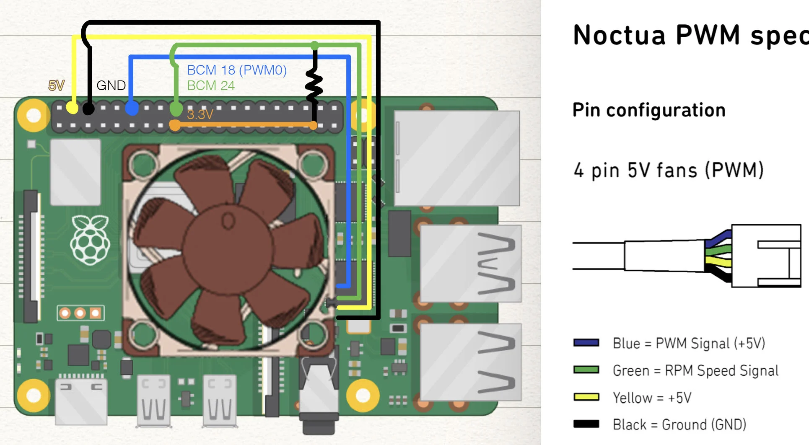

# Raspberry Pi Fan Control

A simple utility written in Rust to help control the fan speed of a Raspberry Pi using hardware PWM to avoid the
software-based PWM that leads to high CPU usage

Developed for the Noctua NF-A4x10 5V PWM fan, but should work with any fan that can be controlled with PWM.

See the wiring diagram below for how to connect the fan to the Raspberry Pi. Note the pull-up resistor bridging the 3.3V
and GPIO pin 24.

I implemented a simple fan curve, seen below.

